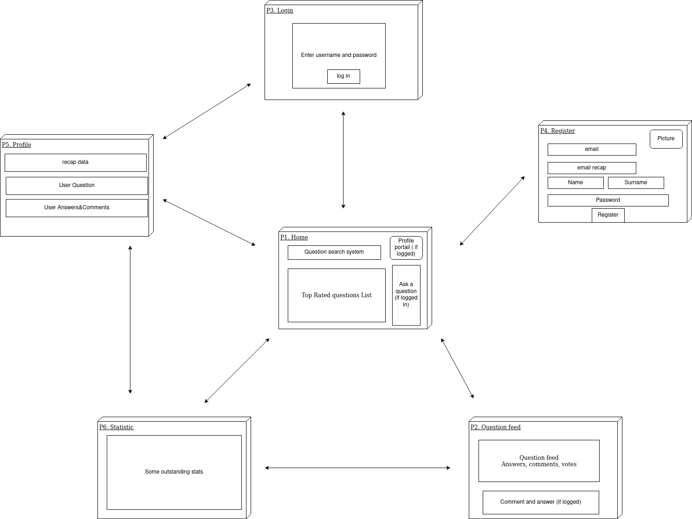
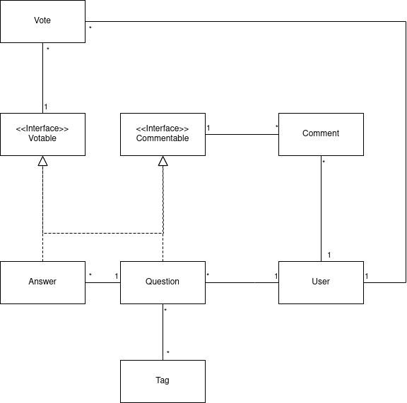

# **StarkOverflow**

> September - November 2020

Table of contents
=================

   * [Table of contents](#table-of-contents)
   * [Introduction](#Introduction)
   * [Requirements](#Requirements)
   * [Quick-start](#Quick-start)
   * [Docker](#Docker)
* [Launch the project manually](#Launch-the-project-manually)
     * [Environment variables](#Environment-variables)
* [Tests](#tests)
  * [E2E - testing](#E2E---testing)
  * [Load testing](Load-testing)
*  [Concept Diagrams](Concept-Diagrams)
  * [Site Map](#Site-Map)
  * [Model](#Model)
* [Contributors](#Contributors)

## Introduction

The purpose of this project is to learn about multi tiered application by creating a simplified version of _Stackoverflow_.


## Requirements

- Maven: 3.6.3
- OpenJDK: 11
- docker-compose


## Quick-start


To run the project, just launch the script.

```bash
$ ./run-application.sh
```

The script will automatically manage the life-cycle of the web application and the database containers.

## Docker

 All services used in this project have been containerized. They are described by the docker-compose `yaml` file below :

```yaml
version: "3.7"
services:
  db:
    image: postgres:latest
    restart: always
    environment:
      POSTGRES_DB: postgres
      POSTGRES_USER: admin
      POSTGRES_PASSWORD: secret
      TZ: 'Europe/Zurich'
      PGTZ: 'Europe/Zurich'
    volumes:
      - ./docker/database/scripts:/docker-entrypoint-initdb.d
    ports:
      - "5432:5432"
    networks:
      - backend

# comment to avoid starting pgadmin along the database and the webapp
  pgadmin:
    image: dpage/pgadmin4:latest
    restart: always
    environment:
      PGADMIN_DEFAULT_EMAIL: dev@starkoverflow.ch
      PGADMIN_DEFAULT_PASSWORD: secret
      PGADMIN_LISTEN_PORT: 80
    ports:
      - "8081:80"
    links:
      - "db:pgsql-server"
    networks:
      - backend


  web:
    image: ghcr.io/digitalpatate/starkoverflow:latest
    environment:
      DB_HOST: db
      DB_PORT: 5432
      DB_NAME: stark_db
      DB_USER: admin
      DB_PASSWORD: secret
    depends_on:
      - db
    ports:
      - "9080:9080"
    networks:
      - backend
networks:
  backend:
    external: false

```

The two images of `Postgres` and `PGAdmin` are located on the Docker Hub whereas the image of the `webapp` is provided by the GitHub Container Registry ; for now there is only the _latest_ tag available for the image.  This custom image is automatically built by the Github actions when someone push code on the master branch.

## Launch the project manually 

First of all make sure to have a database up and ready with the correct configuration. To do so, run the following commands :

```bash
$ cd docker/database
$ docker-compose up -d
```

The related docker-compose file contains only database service and is the very same as previously.

Then launch liberty server by triggering the goal :

```bash
mvn liberty:dev
```

### Environment variables

For local dev, we use the openliberty maven plugin and use the default variable name in the server.xml file to setup the database configuration

```xml
<variable name="DB_HOST" defaultValue="localhost"/>
<variable name="DB_PORT" defaultValue="5432"/>
<variable name="DB_NAME" defaultValue="stark_db"/>
<variable name="DB_USER" defaultValue="admin"/>
<variable name="DB_PASSWORD" defaultValue="secret"/>
<dataSource jndiName="jdbc/postgresql">
        <jdbcDriver libraryRef="postgresql-library"/>
        <properties.postgresql serverName="${DB_HOST}"
                               databaseName="${DB_NAME}"
                               portNumber="${DB_PORT}"
                               user="${DB_USER}"
                               password="${DB_PASSWORD}"/>
</dataSource>
```

With this configuration, the variables can be override with environment variable. Like in the docker-compose :

```yaml
 backend:
    image: ghcr.io/digitalpatate/starkoverflow
    environment:
      DB_HOST: db
      DB_PORT: 5432
      DB_NAME: stark_db
      DB_USER: admin
      DB_PASSWORD: secret
    depends_on:
      - db
    ports:
     - "8080:9080"
    networks:
      - backend
```


### E2E - testing

[See dedicated documentation ](./e2e/README.md)


### Load testing

[See dedicated documentation ](./loadTests/README.md)


## Concept Diagrams

### Site Map



 ###  Model



### Question

- Title
- Content
- Tag list (opt)
- Creation date
- Author (user_ID)

### Comments

- Content 
- Creation date
- Author
- Pointer on question or answer

### Answer

- Content 
- Creation date
- Author
- Pointer on question or answer
- State (Approved)

### Tag

- Name 
- Color

### Vote

- Pointer on question or answer
- Pointer on user

## Contributors

- Simon Walther - simon.walther@heig-vd.ch
- Didier Page - didier.page@heig-vd.ch
- Eric Noel - eric.noel@heig-vd.ch
- Guillaume Laubscher -  guillaume.laubscher@heig-vd.ch
- Bruno Legrand - bruno.legrand@heig-vd.ch