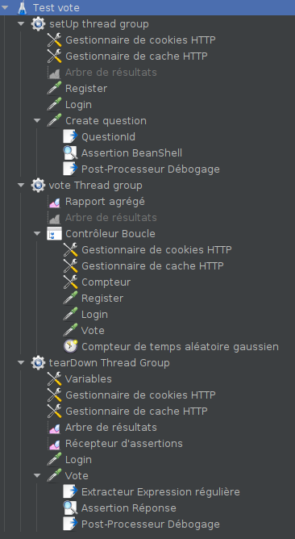

# How to run load tests

1) first make sure that the application server is started. you can run it with Maven with : ```mvn liberty:stop liberty:clean liberty:dev ```
2) now that the server is up, make sure the database is up and empty by executing 
```docker-compose down --v && docker-compose  up``` in ```/docker/database```
3) you must now have StarkOverflow up and running at ```localhost:9080``` with an empty database.
4) you can now open and run tests ```/loadTests/[testFileName].jmx``` with JMeter

## Tests

### Question vote test
To be sure vote are correctly taken in account under high load, we made a test that
test it for question votes.

What do we do in this test ?



First a setUp thread group of 20 units create a question then the question id is retrieved
with a regex in a questionId variable. To have this variable available in other thread
groups we use an Assertion BeanShell.
see : [JMeter pass variables between thread groups](https://devqa.io/jmeter-pass-variables-between-thread-groups/)

After that, the vote Thread group register a user, log in this user and vote on this question.
It does that in a loop for 10 iterations.

Lastly, the tearDown thread group extract the number of vote of the question and assert that the value is 200 (20 units * 10 iterations).

### Results
Our results show that question votes are taken in account even under high load.